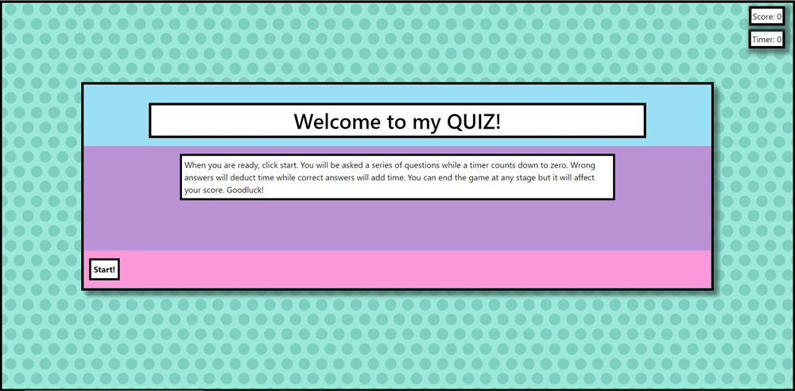

# My Coding Quiz 

## Description

This project has been built to test your knowledge on web coding. 

The quiz required that it be a timed quiz with multiple choice answers. the app will run in the browser and feature dynamically updated HTML and css powered by Javascript.

### Criteria to include: 
* When the star button is clicked, the timer starts and the first question is presented. 
* When a question is answered another question is presented. 
* When a question is incorrectly answered time is deducted from the clock. 
* when all questions are answered or the timer runs out the game is ended
* You can then save your anme and score. 

## Contents: 
1. Installation 
2. Usage
3. Improvements
4. Credits
5. License

## Instalation

To open the quiz please [click this link](https://samwakelam.github.io/04_WEB_API_CODING_QUIZ_SLW/).   
The project can be found at: https://github.com/Samwakelam/04_WEB_API_CODING_QUIZ_SLW

I have used css and javascript to run my html.



## Usage

I have made a couple of amendments to the way the quiz works. 
1. The page displays a welcome page and some basic instructions. the start button with start the quiz and the timer as required. 
2. When you click on the questions, if you are correct or incorrect you are notified for 1 second and the quiz moves on after 1250 miliseconds.
3. You do not get to try the question again and there is no Next question option. You can however end the quiz at any point. 
4. If the user chooses to end the quiz early the timer is reset to zero and the score is totalled accordingly. 
5. If the user progresses through the questios, every wrong anser deducts time but every right answer will add time also.
6. At the end of the quiz the user is notified how many questions they answered correctly and their score is calculated based on:
    * The number of correct answers - the user having only answered 1 question correctly will always score at least 1 point.  
    * Any inncorect answers are deducted from the time remaining as an adittional penalty. 
    * Time remaining is multiplied by the number of correct nswers. 
    * If the quiz is ended early with the End Game button this time bonus is discounted and they score only the number of questions they answered correctly if any. 
    * You cannot score negitivley. 

## Improvements

I wish to look at storing an object in media storage to allow the user to save momre highscores and names and clear the sgtorage if they wish to start scoring again. 
(Update:19.10.2020) I have managed to get an object array to save into local storage and output a sorted list of scores highest to lowest. 
I have not managed yet, to stop the object overwriting after the page is saved and refreshed, nore getting the if statment to fire to remove the lowest high scores after multiple playthroughs. 

```
function getHighScores(){
      console.log("function running");

      console.log("scoreObject = ", scoreObject);
      scoreObject.sort(function(a,b) {
        return b.Score - a.Score;
      });
      console.log("scoreObject sorted = ", scoreObject);
      console.log("scoreObject.length = ", scoreObject.length);

      if (scoreObject.length > 3){
       console.log("if is fireing");
       scoreObject.pop();
      }
      console.log("scoreObject consolodated = ", scoreObject);

      var showHighScores = "";
      for (let index = 0; index < scoreboard.length; index++) {
        showHighScores += scoreObject[index].Name + " = " + scoreObject[index].Score + "<br>";
      }
      return showHighScores;
    }
```

I need to clean up a little on the responsive webpage. 
(Update:19.10.2020) There is jerking on the page when the input field is typed into, would love some feedback here? 

(Update:10.11.2020) Added a score saved indicator as feedback requested. I also added a clear highscores function button. 

## Credits 

Thanks go to:
* Colum Lynagh for assisting me with the methodology for the quiz and all general support.  
* Hannah Sones for sharing some solutions for me to compare with where mine did not seem to work as they should. it was good for working out bugs backwards knowing what I was aiming towards. 

Resources I have referenced:   
W3Schools  
StackOverflow   
WebDev on youtube and GitHub   
The coding train on youtube

## License 

Please feel free to make suggestions and improvement on the workings of the quiz and use the code as a base for your own if you wish. you must make referencec where the code originated if you do. I would also love to see what changes and improvements you make.  

Design by Samantha Wakelam, please respect copyright 2020. 

 
